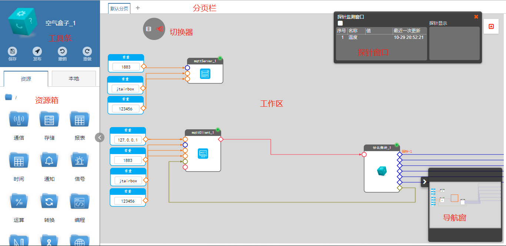
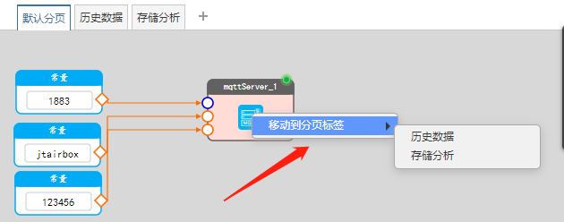
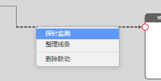
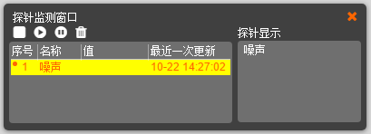
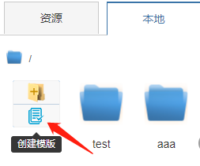
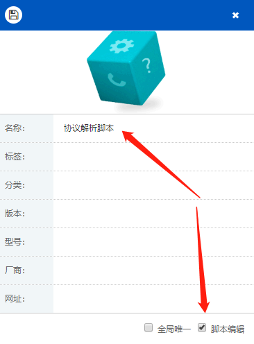
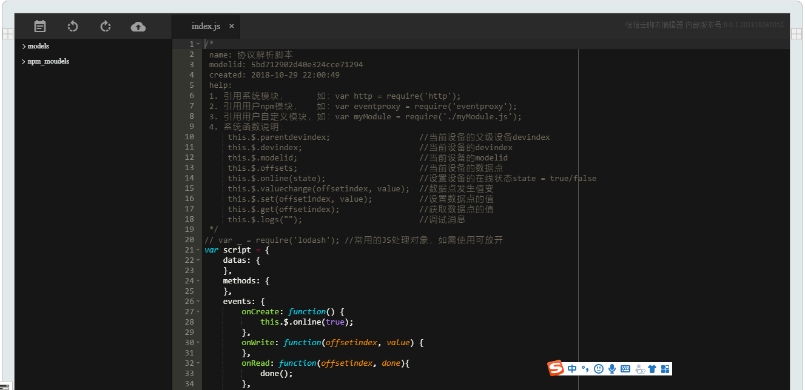

# 数据联动

数据联动部分的功能包括：创建虚拟设备、创建脚本驱动、建立数据流逻辑、以及相应的管理、调试。

在CAT▪IOT-IDE的后面板处理数据联动。



整个后面板分为：工具条、资源箱、工作区、切换器、分页栏、探针窗、导航窗共7部分构成，分别介绍如下。

## 资源箱

资源箱中包括有系统固有资源、接入设备、用户自定义的本地资源3部分。

- 资源

是指系统固有资源，包括通信类、存储类、报表类、通知类、信号类等常用的基础资源，各个资源完全封装成图形化模块，以数据点形式与其它资源进行数据交互。

- 设备

指系统出厂已经封装测试好的硬件设备驱动，同样封装成图形化模块，用户使用时不需要解析处理设备通信协议，按说明配置数据点参数即可实现设备接入。

- 本地

相对于系统固有资源和云盘资源而言，本地资源是由用户自由创建的图形化功能模块，可以是项目应用、虚拟设备、或脚本驱动，本地资源只能存在于CAT▪IOT-IDE服务运行的电脑上。

在标准版以上版本中，可以将本地资源存储到云盘中，在多台电脑上共享，或分享给其他用户使用。

<p class="tip">资源箱中的资源，可以看做是模板，拖放到工作区后生成一个个独立的、具有唯一ID的虚拟设备实例</p>

## 工作区

CAT▪IOT-IDE是图形化开发环境，所有功能都封装成图形模块使用，清晰、直观、易用。

工作区是各种资源模块放置、联动、调试、管理的一个区域，资源箱中的资源只能拖放到工作区中使用。

工作区中可以创建文件夹，将相关资源实例归类。

<p class="tip">资源放置到工作区后，生成资源实例，包括虚拟设备、脚本驱动、项目应用</p>

<p class="tip">修改工作区中的资源实例后，其它来自相同资源模板的资源实例也会同步更新</p>

## 分页

一个工作区页面如果放置过多的资源实例，会导致内容混乱，以及页面加载耗时过长。

一般情况下，通过文件夹归类内容，或者通过分页归类内容。

用户可以自由增删分页页面，可以在分页间移动资源实例。

选中资源实例，鼠标右键点击出现菜单，可以将该资源实例从当前分页移至其它分页：



## 探针

两个数据点之间建立数据联动后，可以通过探针功能来探测该联动上是否有数据通过。

操作方法：

- 选中目标联动线，鼠标右键弹出快捷菜单，如下图所示，点击“探针监测”：



- 弹出探针监测面板，选中探测行，点击“开始”，在右侧“探针显示”区域显示联动线上的实时数据：



探针列表中标明输出数据点的名称、值、最后一次更新的时间。

可以选中多条联动线同时探测。


## 发布

发布是将保存的联动逻辑运行起来的过程。

> 发布时机

在编辑或修改过程中，CAT▪IOT-IDE只将数据保存下来，没有更新到已有的运行中。

在需要的时候，点击“发布”按钮，后台会将修改的数据逻辑更新到现有运行环境中，执行新的修改。

发布按钮如下图所示：


<p class="tip">发布操作只将变动部分更新到运行中，是增量操作</p>

## 重启

重启即重新启动，系统将停止现有运行，自动复位后重新执行全部逻辑。

重启相比较发布，耗时会随着数据逻辑量大而增长。

只有在主工作区面板，才能操作系统“重启”：

重启按钮如下图所示：


## 脚本

脚本是系统运算的最小单元。

脚本用脚本驱动模块封装，具有输入、输出数据点，能够参与数据联动。

> 创建脚本驱动模块

- 如下图所示，在后面板中创建一个脚本驱动模块：



在对话框中输入名称，勾选“脚本编辑”



- 双击脚本实例模块，打开脚本编辑器，显示效果如下：



脚本编辑器包括：

**输入数据点** - 位于编辑器左侧

**输出数据点** - 位于编辑器右侧

**工具条** - 包括保存、撤销、重做、发布按钮，发布让后台创建脚本实例，开始执行脚本运行

**文件树** - 脚本文件层次划分集中区域

**编辑区** - 编辑脚本代码的区域

- 脚本格式说明：

```js
var script = {
    datas: {
    },
    methods: {
    },
    events: {
        onCreate: function() {
            this.$.online(true);
        },
        onWrite: function(offsetindex, value) {
        },
        onRead: function(offsetindex, done){
            done();
        },
        onDestroy: function (done) {
            this.$.online(false);
            done();
        }
    }
};
```

|名称|子项|描述|
|-------------|:-------|:-------|
|datas||在此处定义变量|
|methods||在此处定义方法|
|events||接收系统触发的事件|
||onCreate|脚本创建事件，即，脚本生命周期起始|
||onDestroy|脚本销毁事件，即，脚本生命周期结束|
||onWrite|接收到写输入数据点事件，offsetindex表示数据点编号，value表示要写入的值|
||onRead|接收到读数据点事件，offsetindex表示数据点编号，done(value)表示返回数据点的值|

使用脚本时，对模块的引用方式如下：

 1. 引用系统模块，      如：var http = require('http');
 
 2. 引用用户npm模块，   如：var eventproxy = require('eventproxy');
 
 3. 引用用户自定义模块，如：var myModule = require('./myModule.js');

脚本编辑器提供几种系统专用函数调用：

|名称|描述|
|-------------|:-------|
|this.$.parentdevindex|当前虚拟设备的父级设备devindex|
|this.$.devindex|当前虚拟设备的devindex|
|this.$.modelid|当前虚拟设备的modelid|
|this.$.offsets|当前虚拟设备的数据点|
|this.$.online(state)|设置虚拟设备的在线状态state = true/false|
|this.$.valuechange(offsetindex, value)|有值变产生时，调用该函数向目标数据点输出|
|this.$.set(offsetindex, value)|设置数据点的值|
|this.$.get(offsetindex)|获取数据点的值|
|this.$.logs("")|调试消息|
