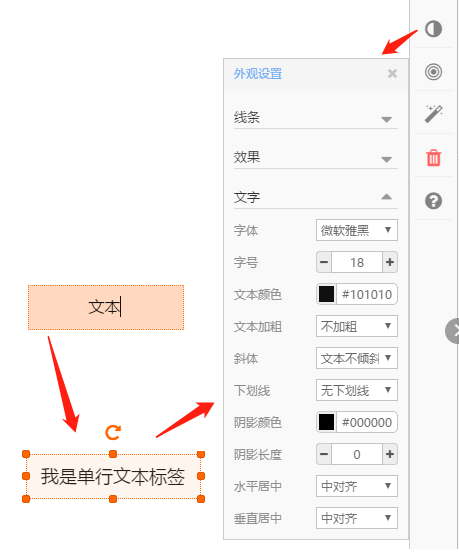
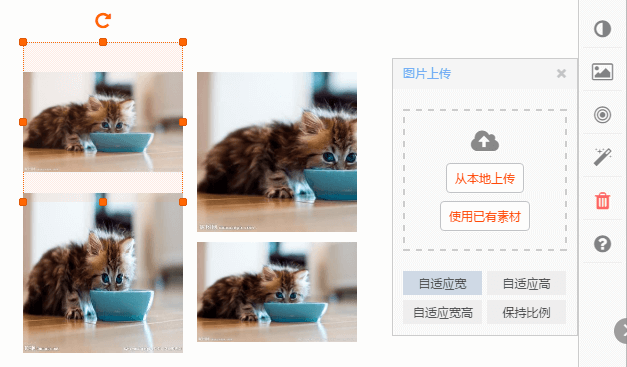
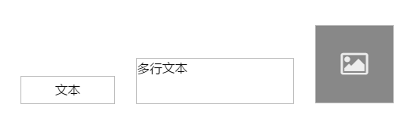
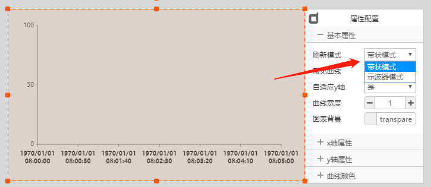

# 页面组态

使用图形化组态编辑器来生成交互显示页面。

## 编辑器

**页面组态编辑器**用来创建交互界面，生成基于web的显示页面，在支持浏览器的任何设备上都可以运行。编辑器如下图所示：

> 构成

编辑器由工作区、组件箱、控制栏、工具条、页面容器等5部分构成。

- **工作区**: 即页面的显示区域，把组件箱中的组件拖拽至工作区，放到合适的位置，通过属性框配置组件的尺寸、颜色、行为等属性，最终组合成目标显示页面。

- **组件箱**：页面是由若干显示组件单元构成的，组件箱提供创建页面的各种必要组件，并会持续更新丰富。

- **控制栏**：提供基本的操作功能，包括“保存”、“撤销”、“重做”、“发布”、“重启”。

- **工具条**：为工作区编辑提供常用的操作功能，如“复制”、“粘贴”等。

- **页面容器**：提供页面管理功能，包括页面创建、修改、删除、分组、组件列表等。

显示时，页面宽度会自适应到屏幕的宽度，页面高度根据原始宽高比例自动调整

## 预览

页面编辑过程中，需要快速查看实际显示效果，可以点击“工具条”右侧的“预览”按钮，如下图：

打开预览页面后，鼠标移至页面最右侧，会出现“关闭”按钮和“显示调整”按钮，如下图所示，“显示调整”按钮可以切换全屏模式和实际尺寸模式。

预览页面不具有实时数据收发功能，只能查看显示样式效果。

## 发布

> 发布是指将保存的页面数据更新到url访问地址的操作。

页面编辑过程中，点击“保存”按钮，服务器后台把当前页面数据保存到数据库中，但页面的url访问数据并没有更新，点击“发布”按钮，会产生两个操作效果：

- 将页面数据更新到url

- 将页面显示组件实例化到后面板，可参与数据联动

## 页面

> 交互界面以页面为显示单元，不同页面之间可以互相切换。

**页面容器**如下图所示：

可以创建页面分组、创建页面、复制页面、编辑页面、删除页面，点击“编辑页面”按钮，出现如下图所示的操作窗体:

- 页面名称：修改页面的显示名称

- 页面类型：包括“PC页面”和“手机页面”两类，电视大屏显示页面属于“PC页面”类型

- 页面尺寸：自定义页面的显示尺寸，以“像素”为单位

- 上传背景：上传当前页面的背景图片

- 二维码：其中包含页面的访问地址，可以通过手机扫码来查看页面

- 公开链接：指本页面对外的公开url地址，可以输入到浏览器中打开页面

## 组件资源

组件是页面构成的基本单元，作为显示资源，页面组态编辑器为用户提供常用的多种类型组件，并会持续的更新丰富，尽可能的满足用户大多数需求。

组件箱分为**布局**、**控件**、**软设**、**素材**、**母版**5种分类，详细使用如下。

## 布局类

布局类组件用来装饰页面，不具有操作数据点，所以不会再后面板中产生映射实例。

> 形状

拖出“矩形”组件，选中矩形，点击右侧属性“外观”按钮，可以调整矩形的背景、边框线条、阴影效果等属性参数。

点击右侧属性“布局”按钮，可以调整矩形的旋转角度、长宽尺寸、显示位置等属性参数。

点击右侧属性“动画”按钮，可以设置矩形显示时的出场动作，如本例中矩形以“弹跳”动画显示出来。

*其它布局类组件，用法与“矩形”类似。*

> 标签

标签包括：单行文本标签、多行文本标签、图标标签，这些标签用来在页面中标注文字和图标，可以通过属性框来调整显示样式，适配页面显示效果。

拖出“单行文本标签”，双击标签编辑文字，点击右侧属性“外观”按钮，调整显示文本的字体、字号、颜色等显示效果。

> 图片框

拖出“图片”组件，如上图所示，选中图片，打开“上传图片”属性框，从本地上传一张图片，图中4张图片分别代表4种适应模式：

**自适应宽** - 图片显示宽度始终和包络框宽度相等

**自适应高** - 图片显示高度始终和包络框高度相等

**自适应宽高** - 图片显示宽度、高度始终和包络框宽度、高度相等

**保持比例** - 图片在包络框区域完全显示，高度和宽度按照包络框高度、宽度中最小的为参考，保持原始显示比例不变

> 时间

时间组件包括：日期、时间、星期，时间组件可以自动获取浏览器前端的当前时间，可以组合出如下效果：

日期和时间组件，通过私有属性可以选择显示样式：

> 容器

容器组件用来将页面上的显示组件进行分类归整。

- 其中Groupbox、水平分割框、垂直分割框属于装饰性容器，将其它组件拖放其中，在显示效果上具有分组功能，但和组件之间没有隶属关系。

- 其中轮播图、单面板、切换面板属于隶属性容器，放置的组件都属于其子组件，具有父子隶属关系。需要双击容器组件，打开子面板操作。

**容器类**编辑流程如下：

**step1:**

拖出单面板组件，如下图所示，根据提示双击组件

**step2:**

双击后进入面板容器页面，在其中拖放其它组件

**step3:**

编辑完成，点击左上角的按钮返回

容器组件中不能再放置容器组件

> 链接

链接包含超链接和图层链接，超链接指链接到外部网站，图层链接指页面之间的链接跳转。

 - 超链接的使用
 
 拖出一个“单行文本标签”，设置文字“打开百度”，再拖出一个“超链接”组件，覆盖在文本标签上面，且设置置顶，如下图所示：
 
 
 
 在私有属性中填上百度域名即可。
 
 页面运行时，鼠标移动到“打开百度”上面时，显示为手状指针，点击即可打开百度首页。

 - 页面跳转
 
 拖出一个“单文本标签”，设置文字“跳转到第二页”，再拖出一个“图层链接”组件，覆盖在文本标签上面，且设置置顶，如下图所示：
 
 
 
 在私有属性中选择待跳转的页面名称即可。
 
 页面运行时，鼠标移动到“跳转到第二页”上面时，显示为手状指针，点击即可跳转显示出第二页页面。

 
链接组件自身显示透明，可放置到任何组件上跳转

 > 页眉页脚

 用来装饰页面的顶部和底部，拖出后组件能够自动放置到页眉和页脚部位，可调整显示效果和文字。

 ## 控件类

 控件组件类似常用的windows组件，与布局类的区别是，每个控件类组件都可以实现交互操作，发布后在后面板有相应的组件实例，可以参与数据流联动触发。

> 消息提示框

需要修改美化组件，然后补充说明

> toast消息提示

一个触发型消息提示组件。

正常运行时，toast消息提示框处于隐藏状态，当给定一个输入字符串时，触发消息提示显示出来，并显示给定的字符文本。

使用例子：

- 拖出“toast消息提示”组件，如下图所示，通过属性框配置背景色和文字颜色。再拖出一个“文本输入框”组件：

- 设置“toast消息提示”组件的私有属性，显示位置选择“页面右下角”，触发显示后等待3000ms自动隐藏：

- 保存，发布，切换到后面板，看到两个组件的实例，将文本输入框的输出数据点联动到toast消息提示的输入，如下图：

点击后面板的“保存”“发布”

- 拷贝页面url，在浏览器中打开运行，向输入框中输入文字后，会看到触发输出的消息提示，如下图：

> 显示控件

运行时，能够动态显示给定的数值的组件，此处包括显示单行文本组件、显示多行文本组件、显示图片组件。

- 拖出上述3种组件，设置属性，如下图所示：

- 保存，发布，切换到后面板，看到三个组件的实例，如下图：

可以看到，每个组件都有一个输入数据点，文本显示组件需要输入文本字符，图片显示组件需要输入图片的存放地址。

使用时，将要显示的数据源联动给显示组件，运行状态即可动态显示数据。

> 按钮

按钮用来触发一个鼠标点击输入，当点击按钮时，组件输出预先设定的值。里的按钮包括：触发按钮、带使能按钮、导出按钮。其中：

- **触发按钮** - 点击按钮一次，触发输出一个值，该值可以预设

- **带使能按钮** - 按钮具有一个输出数据点和一个输入数据点，输入数据点值为0时，可使按钮处于无效状态

- **导出按钮** - 专用于报表导出，后面板生成报表后，将报表的存放路径联动给本组件的输入数据点，此时导出按钮有效，点击可以下载导出报表文件

上述三种按钮的后面板实例显示如下：

> 窗体

该控件需要美化，再写说明

> 手势

用在手机或PAD上，手指向上滑动时，能够翻页到指定的页面。

拖出手势控件，在私有属性中选择手势方向，延迟时间，跳转到的目标页面

运行时，手势控件在页面中处于隐藏状态

> 选择

选择型输入控件，包括单选、复选、下拉、日期时间等。

> 单选框

单选框用在已知多个选项，但一次只能选中一个的场景。

- 拖出两个单选组件，配上文本标签，如下图所示：

鼠标框选选中两个单选组件，点击工具条上的“组合”按钮，将两者组合起来，形成一个单选组，单选组在运行中只允许选中其中的一项。

- 设置单选控件的私有属性，可以设置选中状态2的输出值和非选中状态1的输出值：

- 保存发布，切换到后面板，创建脚本虚设，将单选实例的输出联动给脚本数据点，在脚本中处理逻辑：

> 复选框

> 下拉、选择框

包括数字下拉框、文本下拉框、文本选择框、数字选择框。

- 可以在私有属性中预先定义选项值，运行时有选择操作，后面板实例数据点输出选中项。

- 后面板实例中，有两个数据点：

**输出数据点** - 选择改变时输出相应项的值

**输入数据点** - 用来初始化选择框的当前值

> 日期、时间

> 输入控件

包括文本输入、数值输入、滑块输入等控件，运行时可以通过鼠标键盘操作来输入文本、数字。

- 输入控件在后面板都有一个输入数据点和一个输出数据点：

**输出数据点** - 有输入改变时输出相应的值

**输入数据点** - 用来初始化输入组件的当前值

> 表格

> 进度

进度指示控件，用来显示任务的进展比例，包括线性和环形两类显示样式。

- 进度指示控件都有一个输入数据点，输入进度值，如显示控件属性中设置进度值范围为0-200，输入值为80，表示进度为40%

 ## 软设类

软设指具有交互功能的常用组件，多用于人机界面，包括仪表盘、按钮、指示灯等。

> 指示灯

指示系统或设备的运行状态，包括两状态指示和多状态指示：

- 多状态指示灯

通过私有属性，设置指示灯的状态数量，为每个状态添加相应的显示图片以及触发值。该多状态图片指示灯，可以根据实际需要做出多种多样的效果出来。

- 颜色指示灯

通过私有属性，设置指示灯的状态数量，为每个状态设置相应的显示颜色以及触发值。该多状态颜色指示灯，只能显示圆形形状，适合一般的应用场景。

- 两状态指示灯

通过私有属性，设置指示灯的状态触发值。

该指示灯为固定两状态指示灯，是一个常用的简化应用方式。

> 数码管

模拟数码显示LED，具有多种显示样式，能够显示整数、小数、负数。

- 8段位数码管

组件箱中的“数码管一”和“数码管二”是8段位数码管，即最多显示8个段位。

- 多段位数码管

组件箱中的“数码管三”和“数码管四”是多段位数码管，即显示段位数量可以任意多。

- 后面板实例

所有数码管软设，都有一个输入数据点，用于动态显示给定值。

> 仪表盘

模拟仪表样式的显示组件。

分为两大类：常用仪表盘组件和自定义仪表盘组件

**常用仪表盘组件** - 组件箱中给出的固定样式的组件，可以调整尺寸和颜色

**自定义仪表盘组件** - 仪表指针组件，通过自定义指针和表盘背景，组合出多种样式的仪表盘

- 常用仪表盘组件

该类组件都可以通过私有属性设置颜色、范围等参数

仪表类组件只有一个输入数据点，用来输入实时值

- 自定义仪表盘组件

**Step1:** 上传一个表盘图片和一个指针组件，将两者组合成一个仪表盘，如下图所示，拖出一个图片框，上传表盘图片，再拖出一个指针软设，修改指针图片：

**Step2:** 通过指针的私有属性，修改指针图片：

**Step3:** 将指针拖放到表盘上，设置置顶，通过私有属性调整指针的旋转中心、输入值范围、旋转角度，然后同时选中表盘和指针，点击工具条的“组合”，形成一个新的自定义表盘，效果如下：

**Step4:** 后面板实例，具有一个输入数据点，来给仪表盘赋值：

> 刻度表

模拟温度计等具有刻度指示的软设组件。

分为两大类：常用刻度组件和自定义刻度组件

**常用刻度组件** - 组件箱中给出的固定样式的组件，可以调整尺寸和颜色

**自定义刻度组件** - 刻度指针组件，通过自定义指针和背景，组合出多种样式的刻度表

- 常用刻度组件

该类组件都可以通过私有属性设置颜色、范围等参数，当前只提供温度计组件，如下：

- 自定义刻度组件

**Step1:** 上传一个刻度表图片和一个刻度指针组件，将两者组合成一个刻度表，如下图所示，拖出一个图片框，上传刻度表图片，再拖出一个位移指针软设：

**Step2:** 将指针拖放到刻度表图片上，设置置顶，通过私有属性调整指针的起止位置、输入值范围、移动方向：

**Step3:** 同时选中表盘和指针，点击工具条的“组合”，形成一个新的自定义刻度表，效果如下：

**Step4:** 后面板实例，具有一个输入数据点，来给刻度表赋值：

> 开关

包括触发开关、切换开关两大类。

**触发开关** - 点击后会自动恢复到初始状态，每次点击触发输出一次固定值

**档位开关** - 点击后会切换并保持到新的状态，每次点击触发输出相应状态的值

- 自定义触发开关

开关样式可以自行用图片定义，需要默认状态图片和按下触发两个图片。

通过私有属性框配置触发输出值。

每次点击开关时，都会通过输出数据点触发输出一次该值。

- 自定义多档位切换开关

用于多档位控制的场景，比如风扇调速，需要多个切换档位。

拖出一个“多档位开关”，打开私有属性，添加或删除档位，为每个档位添加图片和输出值：

“开启”属性中：

**是否循环** - 当切换到最后一个档位时，再次点击是否从第一个档位再次开始

**状态切换** - 横向点击触发，表示点击左半部分和右半部分进行前进后退切换；纵向点击触发，表示点击上半部分和下半部分进行前进后退切换

自定义多档位切换开关具有两个数据点，输入数据点用来设置开关的初始值，输出数据用来触发输出值：

- 常用两档位开关

提供固定显示样式的两档位切换开关，包括二档开关一、二档开关二、二档开关三、二档开关四，显示样式不能修改，但可以设置触发输出值。

常用两档位开关具有两个数据点，输入数据点用来设置开关的初始值，输出数据用来触发输出值：

> 液位

液位状态指示软设组件，提供的4种组件具有类似的用法，都有一个输入数据点，通过私有属性设置输入值范围和显示样式。

设置液位组件属性，包括最大值、最小值，以及其它显示属性：

> 旋转

给定输入值，能够产生360°循环转动的软设组件。

拖出旋转组件，可以通过私有属性更换显示图片:

输入数据点，可输入正值和负值，正值让图片顺时针旋转，负值逆时针旋转：

默认以图片中心为旋转中心

> 实时曲线

能够实时接收数据输入，并动态显示的曲线。

实时曲线有如下几个特点：

- 曲线具有两种刷新模式：带状模式、示波器模式

    **带状模式**： 最为常用模式，从左至右显示数据。最右边是最新数据，添加新数据后，曲线将向左移动，同时显示新数据，并擦除旧数据。
    
    **示波器模式**： 数据由左至右填充，绘图至右边界时，擦除原曲线，并重新由左至右填充。

- 曲线x轴可以工作在 “时间” 或 “计数” 模式

*时间* 模式下，x轴坐标点自动显示接收值的当前时间

*计数* 模式下，x轴坐标点显示接收到的数据计数

- 可以同时显示一条或多条曲线

实时曲线的数据输入，需要借助 **曲线异步适配器** 做转换，适配器可以动态增加输入数据点通道，每个通道代表一条曲线，如图：

适配器每个通道输入类型为float浮点数，直接输入采样值

