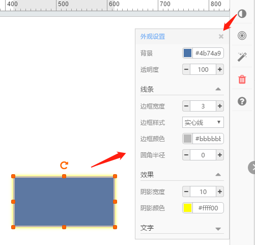
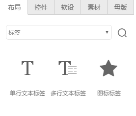
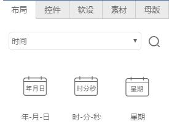
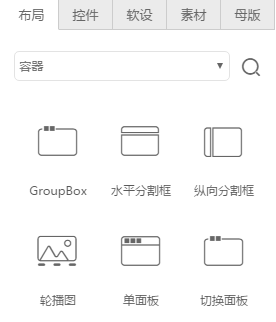
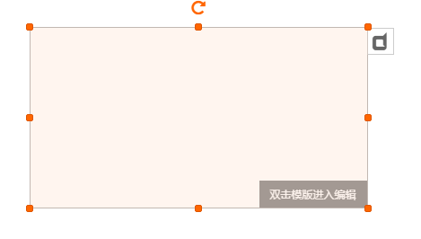
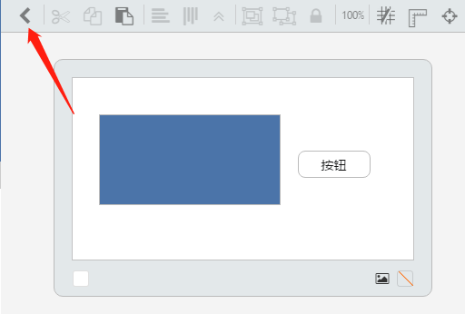
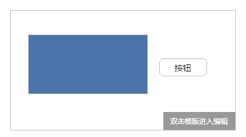
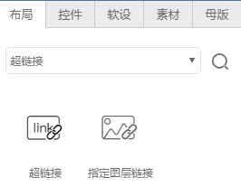
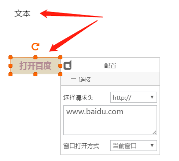
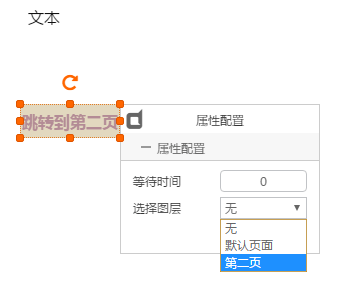

# 布局类

布局类组件用来装饰页面，不具有操作数据点，所以不会再后面板中产生映射实例。

## 形状

这里以形状列表中的“矩形”为例：

拖出“矩形”组件，选中矩形，点击右侧属性“外观”按钮，可以调整矩形的背景、边框线条、阴影效果等属性参数。

点击右侧属性“布局”按钮，可以调整矩形的旋转角度、长宽尺寸、显示位置等属性参数。

点击右侧属性“动画”按钮，可以设置矩形显示时的出场动作，如本例中矩形以“弹跳”动画显示出来。

*其它布局类组件，用法与“矩形”类似。*

## 标签

标签包括：单行文本标签、多行文本标签、图标标签，这些标签用来在页面中标注文字和图标，可以通过属性框来调整显示样式，适配页面显示效果。

拖出“单行文本标签”，双击标签编辑文字，点击右侧属性“外观”按钮，调整显示文本的字体、字号、颜色等显示效果。

## 图片框

拖出“图片”组件，如上图所示，选中图片，打开“上传图片”属性框，从本地上传一张图片，图中4张图片分别代表4种适应模式：

**自适应宽** - 图片显示宽度始终和包络框宽度相等

**自适应高** - 图片显示高度始终和包络框高度相等

**自适应宽高** - 图片显示宽度、高度始终和包络框宽度、高度相等

**保持比例** - 图片在包络框区域完全显示，高度和宽度按照包络框高度、宽度中最小的为参考，保持原始显示比例不变

## 时间

时间组件包括：日期、时间、星期，时间组件可以自动获取浏览器前端的当前时间，可以组合出如下效果：

日期和时间组件，通过私有属性可以选择显示样式：

## 容器

容器组件用来将页面上的显示组件进行分类归整。

- 其中Groupbox、水平分割框、垂直分割框属于装饰性容器，将其它组件拖放其中，在显示效果上具有分组功能，但和组件之间没有隶属关系。

- 其中轮播图、单面板、切换面板属于隶属性容器，放置的组件都属于其子组件，具有父子隶属关系。需要双击容器组件，打开子面板操作。

**容器类**编辑流程如下：

**step1:**

拖出单面板组件，如下图所示，根据提示双击组件

**step2:**

双击后进入面板容器页面，在其中拖放其它组件

**step3:**

编辑完成，点击左上角的按钮返回

容器组件中不能再放置容器组件

## 链接

链接包含超链接和图层链接，超链接指链接到外部网站，图层链接指页面之间的链接跳转。

 - 超链接的使用
 
 拖出一个“单行文本标签”，设置文字“打开百度”，再拖出一个“超链接”组件，覆盖在文本标签上面，且设置置顶，如下图所示：
 
 
 
 在私有属性中填上百度域名即可。
 
 页面运行时，鼠标移动到“打开百度”上面时，显示为手状指针，点击即可打开百度首页。

 - 页面跳转
 
 拖出一个“单文本标签”，设置文字“跳转到第二页”，再拖出一个“图层链接”组件，覆盖在文本标签上面，且设置置顶，如下图所示：
 
 
 
 在私有属性中选择待跳转的页面名称即可。
 
 页面运行时，鼠标移动到“跳转到第二页”上面时，显示为手状指针，点击即可跳转显示出第二页页面。

 
链接组件自身显示透明，可放置到任何组件上跳转

 ## 页眉页脚

 用来装饰页面的顶部和底部，拖出后组件能够自动放置到页眉和页脚部位，可调整显示效果和文字。

