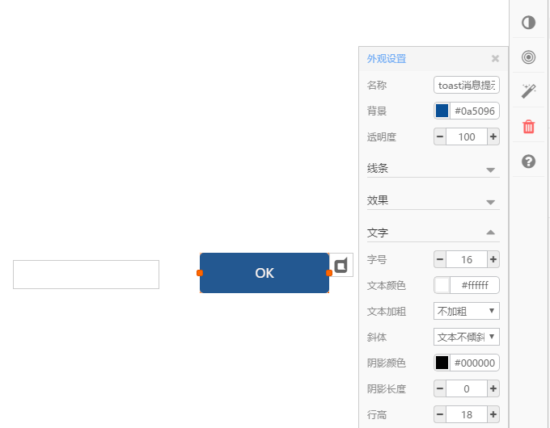
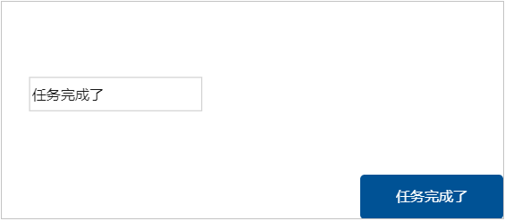
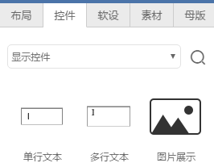
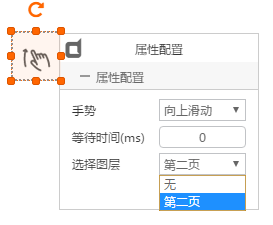
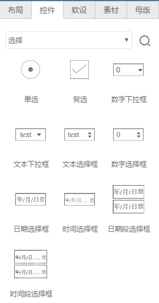
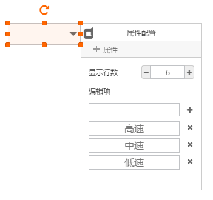
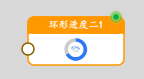

# 控件类

 控件组件类似常用的windows组件，与布局类的区别是，每个控件类组件都可以实现交互操作，发布后在后面板有相应的组件实例，可以参与数据流联动触发。

## 消息提示框

需要修改美化组件，然后补充说明

## toast消息提示

一个触发型消息提示组件。

正常运行时，toast消息提示框处于隐藏状态，当给定一个输入字符串时，触发消息提示显示出来，并显示给定的字符文本。

使用例子：

- 拖出“toast消息提示”组件，如下图所示，通过属性框配置背景色和文字颜色。再拖出一个“文本输入框”组件：

- 设置“toast消息提示”组件的私有属性，显示位置选择“页面右下角”，触发显示后等待3000ms自动隐藏：

- 保存，发布，切换到后面板，看到两个组件的组件实例，将文本输入框的输出数据点联动到toast消息提示的输入，如下图：

点击后面板的“保存”“发布”

- 拷贝页面url，在浏览器中打开运行，向输入框中输入文字后，会看到触发输出的消息提示，如下图：

## 显示控件

运行时，能够动态显示给定的数值的组件，此处包括显示单行文本组件、显示多行文本组件、显示图片组件。

- 拖出上述3种组件，设置属性，如下图所示：

- 保存，发布，切换到后面板，看到三个组件的组件实例，如下图：

可以看到，每个组件都有一个输入数据点，文本显示组件需要输入文本字符，图片显示组件需要输入图片的存放地址。

使用时，将要显示的数据源联动给显示组件，运行状态即可动态显示数据。

## 按钮

按钮用来触发一个鼠标点击输入，当点击按钮时，组件输出预先设定的值。里的按钮包括：触发按钮、带使能按钮、导出按钮。其中：

- **触发按钮** - 点击按钮一次，触发输出一个值，该值可以预设

- **带使能按钮** - 按钮具有一个输出数据点和一个输入数据点，输入数据点值为0时，可使按钮处于无效状态

- **导出按钮** - 专用于报表导出，后面板生成报表后，将报表的存放路径联动给本组件的输入数据点，此时导出按钮有效，点击可以下载导出报表文件

上述三种按钮的后面板实例显示如下：

## 窗体

## 手势

用在手机或PAD上，手指向上滑动时，能够翻页到指定的页面。

拖出手势控件，在私有属性中选择手势方向，延迟时间，跳转到的目标页面

运行时，手势控件在页面中处于隐藏状态

## 选择

选择型输入控件，包括单选、复选、下拉、日期时间等。

## 单选框

单选框用在已知多个选项，但一次只能选中一个的场景。

- 拖出两个单选组件，配上文本标签，如下图所示：

鼠标框选选中两个单选组件，点击工具条上的“组合”按钮，将两者组合起来，形成一个单选组，单选组在运行中只允许选中其中的一项。

- 设置单选控件的私有属性，可以设置选中状态2的输出值和非选中状态1的输出值：

- 保存发布，切换到后面板，创建脚本模块，将单选实例的输出联动给脚本数据点，在脚本中处理逻辑：

## 复选框

## 下拉、选择框

包括数字下拉框、文本下拉框、文本选择框、数字选择框。

- 可以在私有属性中预先定义选项值，运行时有选择操作，后面板实例数据点输出选中项。

- 后面板实例中，有两个数据点：

**输出数据点** - 选择改变时输出相应项的值

**输入数据点** - 用来初始化选择框的当前值

## 日期、时间

## 输入控件

包括文本输入、数值输入、滑块输入等控件，运行时可以通过鼠标键盘操作来输入文本、数字。

- 输入控件在后面板都有一个输入数据点和一个输出数据点：

**输出数据点** - 有输入改变时输出相应的值

**输入数据点** - 用来初始化输入组件的当前值

## 表格

## 进度

进度指示控件，用来显示任务的进展比例，包括线性和环形两类显示样式。

- 进度指示控件都有一个输入数据点，输入进度值，如显示控件属性中设置进度值范围为0-200，输入值为80，表示进度为40%

