# 软设类

软设指具有交互功能的常用组件，多用于人机界面，包括仪表盘、按钮、指示灯等。

## 指示灯

指示系统或设备的运行状态，包括两状态指示和多状态指示：

- 多状态指示灯

通过私有属性，设置指示灯的状态数量，为每个状态添加相应的显示图片以及触发值。该多状态图片指示灯，可以根据实际需要做出多种多样的效果出来。

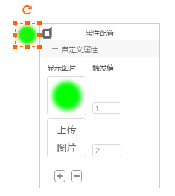

- 颜色指示灯

通过私有属性，设置指示灯的状态数量，为每个状态设置相应的显示颜色以及触发值。该多状态颜色指示灯，只能显示圆形形状，适合一般的应用场景。

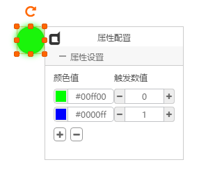

- 两状态指示灯

通过私有属性，设置指示灯的状态触发值。

该指示灯为固定两状态指示灯，是一个常用的简化应用方式。

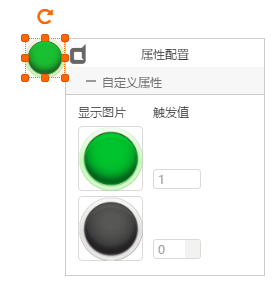

## 数码管

模拟数码显示LED，具有多种显示样式，能够显示整数、小数、负数。

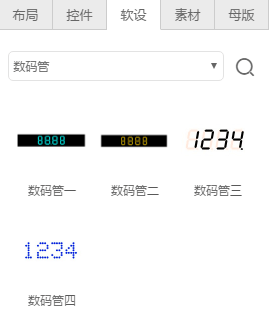

- 8段位数码管

组件箱中的“数码管一”和“数码管二”是8段位数码管，即最多显示8个段位。

- 多段位数码管

组件箱中的“数码管三”和“数码管四”是多段位数码管，即显示段位数量可以任意多。

- 后面板实例

所有数码管软设，都有一个输入数据点，用于动态显示给定值。

## 仪表盘

模拟仪表样式的显示组件。

分为两大类：常用仪表盘组件和自定义仪表盘组件

**常用仪表盘组件** - 组件箱中给出的固定样式的组件，可以调整尺寸和颜色

**自定义仪表盘组件** - 仪表指针组件，通过自定义指针和表盘背景，组合出多种样式的仪表盘

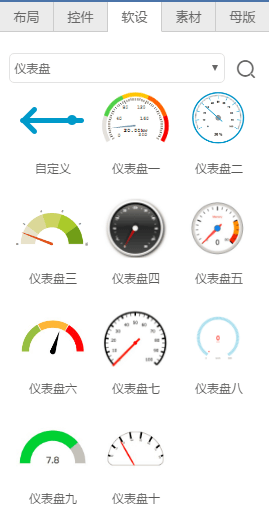

- 常用仪表盘组件

该类组件都可以通过私有属性设置颜色、范围等参数

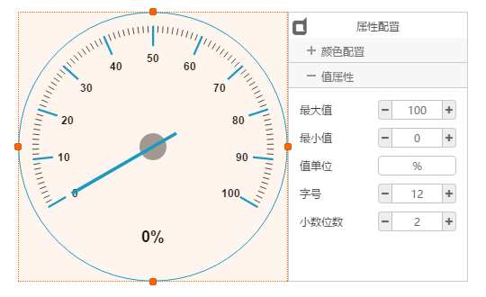

仪表类组件只有一个输入数据点，用来输入实时值

- 自定义仪表盘组件

**Step1:** 上传一个表盘图片和一个指针组件，将两者组合成一个仪表盘，如下图所示，拖出一个图片框，上传表盘图片，再拖出一个指针软设，修改指针图片：

**Step2:** 通过指针的私有属性，修改指针图片：

**Step3:** 将指针拖放到表盘上，设置置顶，通过私有属性调整指针的旋转中心、输入值范围、旋转角度，然后同时选中表盘和指针，点击工具条的“组合”，形成一个新的自定义表盘，效果如下：

**Step4:** 后面板实例，具有一个输入数据点，来给仪表盘赋值：

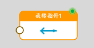

## 刻度表

模拟温度计等具有刻度指示的软设组件。

分为两大类：常用刻度组件和自定义刻度组件

**常用刻度组件** - 组件箱中给出的固定样式的组件，可以调整尺寸和颜色

**自定义刻度组件** - 刻度指针组件，通过自定义指针和背景，组合出多种样式的刻度表

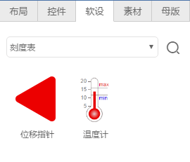

- 常用刻度组件

该类组件都可以通过私有属性设置颜色、范围等参数，当前只提供温度计组件，如下：

- 自定义刻度组件

**Step1:** 上传一个刻度表图片和一个刻度指针组件，将两者组合成一个刻度表，如下图所示，拖出一个图片框，上传刻度表图片，再拖出一个位移指针软设：

**Step2:** 将指针拖放到刻度表图片上，设置置顶，通过私有属性调整指针的起止位置、输入值范围、移动方向：

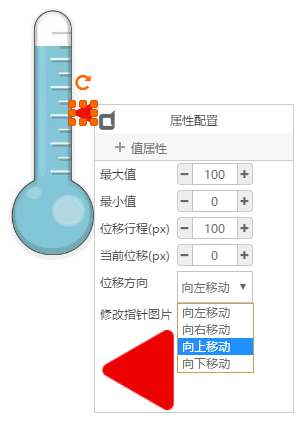

**Step3:** 同时选中表盘和指针，点击工具条的“组合”，形成一个新的自定义刻度表，效果如下：

**Step4:** 后面板实例，具有一个输入数据点，来给刻度表赋值：

## 开关

包括触发开关、切换开关两大类。

**触发开关** - 点击后会自动恢复到初始状态，每次点击触发输出一次固定值

**档位开关** - 点击后会切换并保持到新的状态，每次点击触发输出相应状态的值

- 自定义触发开关

开关样式可以自行用图片定义，需要默认状态图片和按下触发两个图片。

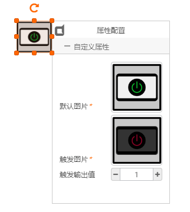

通过私有属性框配置触发输出值。

每次点击开关时，都会通过输出数据点触发输出一次该值。

- 自定义多档位切换开关

用于多档位控制的场景，比如风扇调速，需要多个切换档位。

拖出一个“多档位开关”，打开私有属性，添加或删除档位，为每个档位添加图片和输出值：

“开启”属性中：

**是否循环** - 当切换到最后一个档位时，再次点击是否从第一个档位再次开始

**状态切换** - 横向点击触发，表示点击左半部分和右半部分进行前进后退切换；纵向点击触发，表示点击上半部分和下半部分进行前进后退切换

自定义多档位切换开关具有两个数据点，输入数据点用来设置开关的初始值，输出数据用来触发输出值：

- 常用两档位开关

提供固定显示样式的两档位切换开关，包括二档开关一、二档开关二、二档开关三、二档开关四，显示样式不能修改，但可以设置触发输出值。

常用两档位开关具有两个数据点，输入数据点用来设置开关的初始值，输出数据用来触发输出值：

## 液位

液位状态指示软设组件，提供的4种组件具有类似的用法，都有一个输入数据点，通过私有属性设置输入值范围和显示样式。

设置液位组件属性，包括最大值、最小值，以及其它显示属性：

## 旋转

给定输入值，能够产生360°循环转动的软设组件。

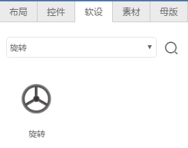

拖出旋转组件，可以通过私有属性更换显示图片:

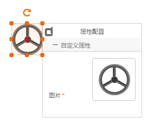

输入数据点，可输入正值和负值，正值让图片顺时针旋转，负值逆时针旋转：

默认以图片中心为旋转中心

## 实时曲线

能够实时接收数据输入，并动态显示的曲线。

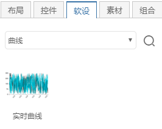

实时曲线有如下几个特点：

- 曲线具有两种刷新模式：带状模式、示波器模式

    **带状模式**： 最为常用模式，从左至右显示数据。最右边是最新数据，添加新数据后，曲线将向左移动，同时显示新数据，并擦除旧数据。
    
    **示波器模式**： 数据由左至右填充，绘图至右边界时，擦除原曲线，并重新由左至右填充。

- 曲线x轴可以工作在 “时间” 或 “计数” 模式

*时间* 模式下，x轴坐标点自动显示接收值的当前时间

*计数* 模式下，x轴坐标点显示接收到的数据计数

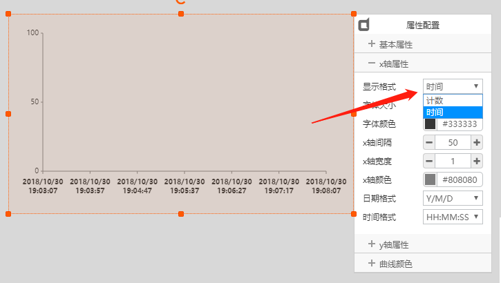

- 可以同时显示一条或多条曲线

实时曲线的数据输入，需要借助 **曲线异步适配器** 做转换，适配器可以动态增加输入数据点通道，每个通道代表一条曲线，如图：

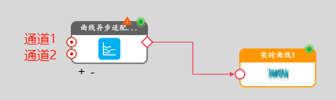

适配器每个通道输入类型为float浮点数，直接输入采样值

