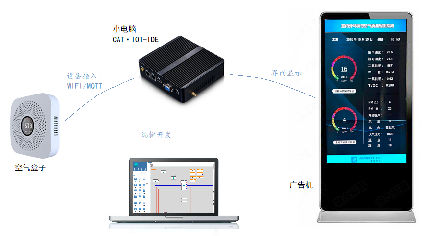
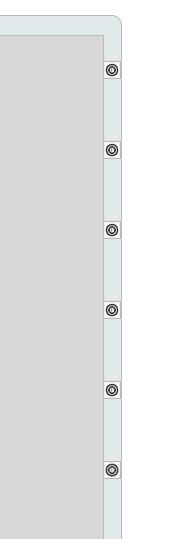
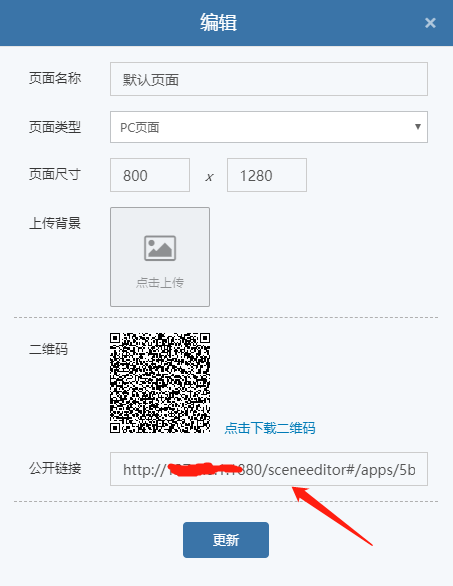

# 入门示例

本章节从一个简单应用例子入手，讲解 CAT▪IOT-IDE 的使用流程。

## 一个简单的室内空气质量监测发布系统

本示例中，在一台小电脑中安装CAT▪IOT-IDE物联网集成开发环境，将一个空气盒子接入该小电脑，用广告机显示CAT▪IOT-IDE编辑的界面和实时数据，实际效果图如下：


系统框架：
- 小电脑作为服务器，通过wifi将空气盒子、广告机、笔记本连接在一个网段内。
- 笔记本通过浏览器访问小电脑内安装的 CAT▪IOT-IDE ，打开集成开发环境，编辑显示界面和设备协议解析
- 空气盒子作为MQTT客户端，连接小电脑内的MQTT服务端
- 广告机播放页面的url地址，即可显示页面




## 开始

> 运行CAT▪IOT-IDE物联网集成开发环境

  小电脑上安装有完整的windows10操作系统。
  - 将软件包collapsar2-win-x64-demo拷贝到小电脑
  - 双击collapsar2-win-x64-demo.exe启动服务，服务窗口如下：
    
    看到打印消息“publishBox end”时，表示服务启动完毕。
  
> 创建设备

  - 在笔记本电脑上打开谷歌浏览器，输入http://127.0.0.1:1880打开登录页面：
  
    
  - 登录
  配置IP地址为小电脑的IP
  默认用户名:cat，密码：cat，登录进入主工作区：
  

  - 左侧资源箱切换到“本地”，点击添加，创建一个名称为“空气盒子”的虚拟设备模块，拖拽到主工作区：
  
  
  
> 编辑广告机显示界面

- 鼠标双击工作区的“空气盒子_1”，弹出属性框，点击“编辑按钮”
  
  
- 打开“空气盒子”的前面板编辑器：  
  

- 调整页面尺寸，分辨率设为广告机的分辨率
点击页面“编辑”按钮:  


设置“页面尺寸”：


- 从组件箱中拖出需要的组件，调整属性，最终页面显示效果如下：
  

  <p class="tip">页面编辑详情，请参考帮助视频《快速入门》<p>
  

> 添加设备数据点

  - 点击前后面板切换按钮，切换到“空气盒子”的后面板，处理设备接入：
  

  - 后面板如下：
  

  - 创建空气盒子的输出数据点：  
  在工作区右侧为设备添加输出数据点，点击“+”，出现空白占位数据点
  

  双击空白数据点，弹出设置对话框：
  

  点击“保存”，创建数据点成功，显示为：
  

  - 继续为空气盒子添加其它数据点，包括湿度、CO2、PM2.5、TVOC、CO等：
  
  

> 设备接入

  <p class="tip">空气盒子使用的是MQTT通信协议，必须在后面板创建MQTT服务端，接受空气盒子的MQTT连接</p>
  
- 从“资源”库中拖出“mqttServer”，配置“监听端口”、“用户名”、“密码”，这几个参数必须与空气盒子中MQTT客户端的参数一致，分别设置为：1883、jtairbox、123456。

  右键单击“mqttServer_1”的输入数据点，可以看到输入常量，点击“单行输入常量”：
  

  创建完常量参数的效果：
  

  至此，空气盒子设备能够和小电脑建立通信连接了。

> 协议解析


  协议解析需要获取空气盒子数据，建立解析脚本，在脚本中编程解析出设备测量值。

  - 从资源箱中，进入“通信” - “MQTT”，拖出mqttClient模块，创建“mqttClient_1”实例，按照下图中所示，配置输入数据点参数，这样，mqttClient_1也能够连接到mqttServer_1:
  

  - 在“本地”中，选择创建“脚本驱动”，命名为“协议解析”，拖放到工作区后生成“协议解析_1”实例，双击打开脚本编辑器，为“协议解析”脚本模块创建如下的数据点：
  （1）输入数据点，接收mqttClient_1的输出，类型为Object
  （2）输出数据点，即解析出的设备监测量，包括湿度、CO2、PM2.5、TVOC、CO，另外增加一个订阅输出数据点，类型为Array
  
  连接效果如下：
  

  双击“协议解析_1”脚本，打开脚本编辑器，在其中用js编写解析程序：
  ```js
  /*
    1. 引用系统模块，      如：var http = require('http');
    2. 引用用户npm模块，   如：var eventproxy = require('eventproxy');
    3. 引用用户自定义模块，如：var myModule = require('./myModule.js');
    4. 系统函数说明：
        this.$.parentdevindex;                   //当前设备的父级设备devindex
        this.$.devindex;                         //当前设备的devindex
        this.$.modelid;                          //当前设备的modelid
        this.$.offsets;                          //当前设备的数据点
        this.$.online(state);                    //设置设备的在线状态state = true/false
        this.$.valuechange(offsetindex, value);  //数据点发生值变
        this.$.set(offsetindex, value);          //设置数据点的值
        this.$.get(offsetindex);                 //获取数据点的值
        this.$.logs("");                         //调试消息
    */
    var _ = require('lodash');

    var script = {
        datas: {
            sendonline: false,
            parentdevindex: "",
            userid: "",
            subdevs: []//[{devindex: "", busport: "", devaddr: "", userid: ""}]
        },
        methods: {
            parseTopic: function parseTopic(topic, callback){
                //from/ver/srcUserId/sflag/epindex/devindex/subindex/userid/offset/cmd
                var strtopic = topic.toString();
                if (strtopic.indexOf('/') < 0) return callback(null);
                var tps = strtopic.split('/');
                if(tps === null)  return callback(null);
                // 主题内容一共9项
                if (tps.length !== 10) {
                    return callback(null);
                }
                var topic_parsed = {
                    'from': tps[0],
                    'ver': tps[1],
                    'srcuserid': tps[2],
                    'devid': {
                        'sflag': tps[3],
                        'epindex': tps[4],
                        'devindex': tps[5],
                        'subindex': tps[6]
                    },
                    'userid': tps[7],
                    'offsetindex': tps[8],
                    'cmd': tps[9]
                };
                callback(topic_parsed);
            },
            checkPayload: function(payload, callback){
                var that = this;
                try{
                    var obj_payload = null;
                    if(_.isString(payload) || _.isObjectLike(payload)){
                        obj_payload = JSON.parse(payload);
                    }else if(_.isObject(payload)){
                        obj_payload = payload;
                    }
                    if(obj_payload &&
                        obj_payload.data &&
                        obj_payload.data.value !== null){
                        callback(obj_payload);
                    }
                }catch (err){
                }
            }            
        },
        events: {
            onCreate: function() {
                this.$.online(true);
            },
            onWrite: function(offsetindex, value) {
                var that = this;
                if(offsetindex == 1){
                    if(value.topic){
                        that.parseTopic(value.topic, function(topic_parsed){
                            var devindex = topic_parsed.devid.devindex;                             
                            //接收到设备上报的值变
                            if(value.payload && topic_parsed.cmd == "valuechange"){
                                var offsetindex = topic_parsed.offsetindex;
                                that.checkPayload(value.payload, function(obj_payload){
                                    var value = obj_payload.data.value;
                                    that.$.valuechange(offsetindex, {
                                        value: value
                                    });
                                });
                            }
                        });
                    }
                }
            },
            onRead: function(offsetindex, done){
                done();
            },
            onDestroy: function (done) {
                this.$.online(false);
                done();
            }
        }

    };
    module.exports = script;

  ```
<p class="tip">脚本详细用法讲解，参考“数据联动”-“脚本”章节</p>


## 发布运行

至此，空气盒子界面和接入完毕，点击保存、发布：


在广告机浏览器中，输入页面的url，即可显示出来：

