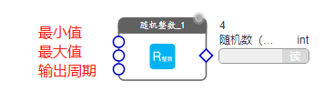

# 系统资源

系统资源是指CAT▪IOT-IDE固有的基本功能模块，包括通信类、存储类、报表类、通知类、信号类等常用的基础资源，各个资源完全封装成图形化模块，以数据点形式与其它资源进行数据交互。

## COM通信

COM通信包括“COM参数”、“COMDriver”、“COM列表”共3个模块。


其中：
- **COM参数**模块
  用来配置串口波特率、数据位、停止位等参数，如下图所示：
  
  参数从上到下依次是：波特率、数据位、停止位、校验、流控、包间隔时间。
  *包间隔时间* 单位是毫秒，表示相隔两个数据包之间的最小间隔时间，用来分包输出。

  左侧是输入数据点，用于从显示界面设置串口参数。
  右侧是输出数据点，输出参数对象，格式如下：
  ```js
  {
    "baudRate":9600,
    "dataBits":8,
    "stopBits":1,
    "flowControl":false,
    "parity":"none",
    "packageInterval":100
  }
  ```
  
- **COM列表**模块
  用来获取系统串口，将获取到的串口名称用下拉列表形式显示出来，供选择使用。
  
  数据点输出串口名称字符串

- **comDriver**模块
  是COM口的驱动模块，配置好参数即可实现COM通信。
  
  左侧输入数据点依次是：COM名称，COM参数，发向COM的数据（数组类型）
  右侧输出数据点是：来自COM的数据（数组类型）

  模块用法：
  
  配置COM名称和参数，接收到COM输出数据后，自定义解析脚本模块，解析出有效数据。


## MQTT通信

系统支持MQTT服务端和客户端两种模式。


- **mqttClient客户端**
如果CAT▪IOT-IDE开发的应用要连接外部平台的mqtt server，只需要拖出mqttClient客户端模块，并配置参数：


<p class="tip">发布运行后，mqttClient会自动连接服务端，并具有断线自动重连能力，连接成功模块右上角指示灯点亮。</p>

**订阅** 数据点
值类型：Array数组，可以向服务端订阅多个主题，
数组格式：[topic1, topic2, topic3]，其中每个topic均为字符串
举例：
```js
[
  "v1/A1B1C1D1/+/cmd",
  "v1/A2B2C2D2/+/cmd",
  "v1/A3B3C3D3/+/cmd"
]
```

**发送** 数据点
值类型：Object对象
对象格式：{topic,payload}
举例：
```js
{
  topic: "v1/A2B2C2D2/1/value",
  payload: 12.3
}
```

**接收** 数据点
值类型：Object对象
对象格式：{topic,payload}
举例：
```js
{
  topic: "v1/A2B2C2D2/1/value",
  payload: 12.3
}
```


- **mqttServer服务端**
拖出mqttServer生成服务实例，接收来自设备或其它mqtt客户端的连接、订阅、数据上传。mqttServer根据订阅分发规则，向客户端实时发送订阅数据。


<p class="tip">mqttServer没有输出数据点，在CAT▪IOT-IDE中只能建立一个mqttClient，通过订阅来获取数据。</p>


## 数据保持器

顾名思义，*数据保持器* 的作用是将接收到的数据保持起来再输出出去。


保持器将数据保存到文件中，当系统重启时，保持器会自动读取保持的数据再输出。
通常用于存储需要初始化的数据点参数。
例如：

将COM名称保持，系统重启时能够向comDriver_1初始化该串口

<p class="tip">数据保持器输入输出数据点均为mixed混合型，因此，可以保持任何类型的数据</p>

## 随机整数

按给定的周期输出随机整数


具有3个输入参数数据点：最大值、最小值、输出周期（单位毫秒）


## 计数器

对外部事件进行触发次数统计，实时输出计数总数。


计数器具有2个输入数据点：触发输入、清零


**触发输入** 数据点
值类型：mixed混合型
说明：可接收任何类型的输入值，即可以统计外部任何事件的触发输出。

**清零** 数据点
值类型：int整型
说明：输入1时将计数清零


## 字符串转换

提供系列字符串和其它类型值之间的互换模块。


- **转字符串**

把其它任何类型的数据转换为字符串，输入数据点为mixed混合类型


- **字符串转数值**

把字符串转换为数值类型，输入的字符串必须是数值字符串，如“23.6”，转换输出为23.6，非数值字符串没有输出。


- **数组转字符串**

把数组类型的输入值，转换为字符串输出


- **对象转字符串**

把对象类型的输入值，转换为字符串输出


- **连接符串**

把多个字符串连接成一个字符串输出

如图中所示，
1. 两个连接字符串模块可以串联
2. 可以点击“+”动态添加输入数据点


## 常量

常量是指在编辑时就设定的参数，整个运行周期内该值都不会变化。

常量分为：文本常量、布尔常量、数值常量、数组常量、对象常量


