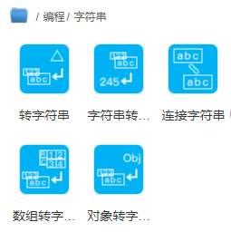
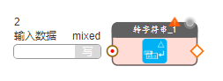
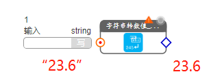

# 编程类

## 字符串转换

提供系列字符串和其它类型值之间的互换模块。

- **转字符串**

把其它任何类型的数据转换为字符串，输入数据点为mixed混合类型

- **字符串转数值**

把字符串转换为数值类型，输入的字符串必须是数值字符串，如“23.6”，转换输出为23.6，非数值字符串没有输出。

- **数组转字符串**

把数组类型的输入值，转换为字符串输出

- **对象转字符串**

把对象类型的输入值，转换为字符串输出

- **连接符串**

把多个字符串连接成一个字符串输出

如图中所示，

1. 两个连接字符串模块可以串联

2. 可以点击“+”动态添加输入数据点

